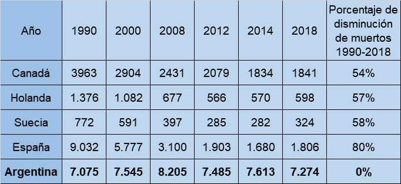

# Análisis de Datos sobre Siniestros Viales en Buenos Aires: Reducir víctimas Mortales

## Introducción

Los incidentes viales, que se producen en las vías de manera repentina e inesperada, son resultado de condiciones y comportamientos irresponsables potencialmente prevenibles. Estos eventos están vinculados a factores humanos, predominantemente vehículos automotores, condiciones climáticas, señalización y características de las vías, y conllevan la pérdida prematura de vidas humanas, lesiones, así como secuelas físicas o psicológicas, daños materiales y perjuicios a terceros.

Fuente: https://www.luchemos.org.ar/es/estadisticas/muertosanuales/muertos-en-argentina-durante-2022

La preocupación por siniestros viales en Argentina destaca desafíos en la infraestructura, comportamiento del conductor y condiciones de tráfico. Factores como la calidad de las carreteras, semáforos y la conciencia vial influyen en la seguridad. Abordar estos aspectos mediante iniciativas gubernamentales y educativas es clave para mejorar la seguridad vial en el país.

En comparación con otros países del mundo, Argentina no ha mostrado avances significativos en cuanto a la reducción de siniestros viales, ya que su tasa de mejora en la disminución de fallecimientos se mantiene en un 0%.

Fuente: https://www.luchemos.org.ar/es/estadisticas/internacionales/comparacion-de-argentina-con-otros-paises

Se dejará el acceso a la página de Luchemos por la vida [aquí](https://www.luchemos.org.ar/es/investigaciones) para que revisen estudios realizados por la organizacion.

## Objetivo

El objetivo de este proyecto sobre siniestros viales en Argentina, CABA, es llevar a cabo un análisis de datos, visualización mediante un dashboard y plantear dos KPIs propuestos:

* Reducir en un 10% la tasa de homicidios en siniestros viales de los últimos seis meses en CABA, en comparación con la tasa de homicidios en siniestros viales del semestre anterior.

* Reducir en un 7% la cantidad de accidentes mortales de motociclistas en el último año en CABA, respecto al año anterior

# Proyecto

## Estructura del repositorio

* **Datasets**: Contiene la información con los archivos entregados para el proyecto, algunos en formato CSV y otros en XLSX. Para visualizarlo, haga clic [aquí](Datasets)

* **Imágenes**: Contiene las imágenes que se utilizarán en el README. Para visualizarlo, haga clic [aquí](Imagenes)

* **ETL**: Incluye las cargas de los datasets y las transformaciones pertinentes de los datos. Para visualizarlo, haga clic [aquí](ETL.ipynb)

* **EDA**: Contiene el Análisis Exploratorio de Datos y las transformaciones necesarias para consumirlas desde el dashboard. Para visualizarlo, haga clic [aquí](EDA.ipynb)

* **Herramientas.py**: Es el módulo utilizado para realizar análisis de los datos y la exportación de los mismos. Para visualizarlo, haga clic [aquí](Herramientas.py)

* **PI_siniestros.pbix**: Contiene el dashboard, el cual puede ser descargado para revisar. Para visualizarlo, haga clic [aquí](PI_siniestros.pbix)

## ETL

El proceso de Extracción, Transformación y Carga fue la primera etapa llevada a cabo en este proyecto. Comenzamos con la carga de un dataset llamado ``homicidios``, el cual contenía dos hojas: 'homicidios' y 'víctimas', cada una con su correspondiente diccionario. Continuamos con la transformación de los datos, realizando tareas como la búsqueda de duplicados, la revisión de todos los tipos de datos de cada columna, y la identificación de nulos. En caso de no tener nulos, verificamos si las columnas tenían valores vacíos. Normalizamos valores que, debido a una letra en mayúscula o un espacio, se contabilizaban como diferentes; por ejemplo, 'Av. Gral Paz' y 'AV. Gral Paz'. Otra transformación consistió en cambiar valores numéricos por cadenas de texto a través de un mapeo para facilitar un análisis posterior en el EDA. Además, eliminamos columnas que no serían utilizadas, como 'Xy_plana', que representaba lo mismo que las columnas 'Long_x' y 'Lat_y' pero en diferentes sistemas de medición. Para visualizarlo, haga clic [aquí](ETL.ipynb)

Finalmente, realizamos una unión de los DataFrames transformados para simplificar el trabajo de análisis y trabajar con todos los datos juntos. Exportamos el archivo a través de un módulo construido con algunas funciones específicas para este proyecto.

## EDA

El Análisis Exploratorio de Datos fue la segunda etapa llevada a cabo en este proyecto. Consistió en la carga del DataFrame resultante del ETL, el cual tenía una columna llamada 'Altura' que no fue tratada en el ETL debido a que contenía un gran porcentaje de valores nulos. Se revisó y se concluyó que tenía una relación con la columna 'Cruce', la cual podía sustituirla y aportar más valor.

Posteriormente, se realizaron visualizaciones específicas para cada variable. El countplot fue la elección principal, ya que muestra un gráfico de barras para representar la cantidad o frecuencia de cada valor único de una variable categórica. También se utilizaron otros tipos de gráficos como barplot, histplot (histograma), lineplot (líneas) y un mapa interactivo, que puede no visualizarse directamente en GitHub. Para ello, se proporciona este [enlace](https://nbviewer.org/github/MaximilianoTauil/PI_Siniestros/blob/main/EDA.ipynb que permite ver el notebook completo de EDA, incluyendo el mapa.

Con estos gráficos y una función de nuestro módulo 'Herramientas', que nos permitía revisar el conteo de valores y el porcentaje que representaban del total, se extrajeron conclusiones de todo el análisis de la columna, junto con un justificativo de por qué se eligió ese tipo de gráfico. Finalmente, se realizó un mapa de correlatividad de las variables consideradas más importantes o relevantes en el análisis de los siniestros viales. Para visualizarlo, haga clic [aquí](EDA.ipynb)

## KPI's

Se dara una breve definicion de kpi para diferenciarlos de las metricas:

 * Un KPI es una métrica específica que evalúa el desempeño de una entidad en relación con sus metas estratégicas. Se utilizan para medir el progreso hacia objetivos, ofreciendo una visión clara del rendimiento en áreas críticas. Los KPIs son seleccionados con cuidado por su conexión directa con los factores clave de éxito, facilitando la toma de decisiones informadas en una organización.

Los KPI's planteados para este proyecto son : 

* Reducir en un 10% la tasa de homicidios en siniestros viales de los últimos seis meses, en CABA, en comparación con la tasa de homicidios en siniestros viales del semestre anterior.

La fórmula para su cálculo es: 

 

* Reducir en un 7% la cantidad de accidentes mortales de motociclistas en el último año, en CABA, respecto al año anterior.

La fórmula para su cálculo es: 

 

# Conclusiones

Los valores generales obtenidos de las conclusiones del EDA son: 

* En 2018 es el año donde hubo más muertes con un 20,93 %.

* La mayoría de las muertes son masculinos con un 76.20 %.

* La mayoria de los siniestros ocurren el dia 15 o a mitad de mes.

* La edad promedio en los siniestros es de 42 años.

* Las avenidas representan el Tipo de calle con mas siniestros contando con un 62.52 %.

* La comuna Nro.1 representa aquella que tiene más siniestros con un total de 13.17 %.

* De las víctimas las que más se encuentran son las motos con un 41.78% y los mas acusados son los autos con 29.46 %.

* El 76.24 % es con cruces de calles.

# Contacto

Si tienes preguntas, comentarios o sugerencias, no dudes en ponerte en contacto conmigo a través de las siguientes vías:

Correo Electrónico: maxi.tauil@gmail.com

¡Gracias!

